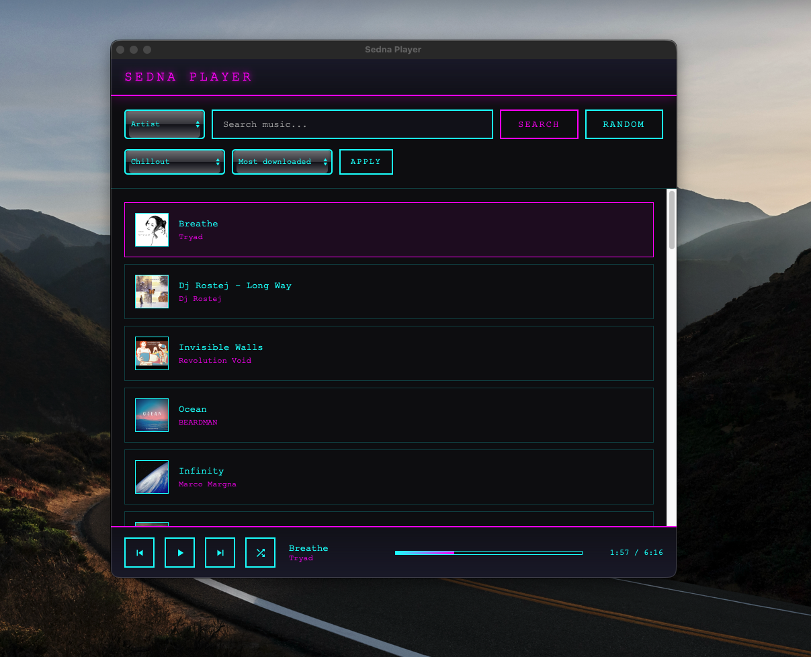

# Sedna Player 🪐

A lightweight, neon-styled desktop music player built with **Tauri** and **Rust**. Streams free, independent music from [Jamendo](https://www.jamendo.com/).



## Features

- 🎵 **Free Music Streaming** - Access 600,000+ tracks from Jamendo's catalog
- 🎨 **Retro-Futuristic UI** - Neon cyan and magenta aesthetic
- 🔍 **Search** - By artist, track, album, or all
- 🎭 **Genre Filters** - Lo-Fi, Ambient, Electronic, Jazz, and more
- 📊 **Sort Options** - By popularity, recent, most played, downloads
- 🎲 **Random Mode** - Discover new music randomly
- 🔀 **Shuffle** - Shuffle playback within results
- ⚡ **Lightweight** - Built with Tauri (much lighter than Electron)

## Screenshots

| Main Player |
|-------------|
|   |

## Tech Stack

- **[Tauri](https://tauri.app/)** - Rust-based framework for lightweight desktop apps
- **[Rust](https://www.rust-lang.org/)** - Backend runtime
- **HTML/CSS/JavaScript** - Frontend UI
- **[Jamendo API](https://developer.jamendo.com/)** - Music streaming service

## Prerequisites

- [Node.js](https://nodejs.org/) (v18 or higher)
- [Rust](https://www.rust-lang.org/tools/install)
- [Jamendo API Key](https://devportal.jamendo.com/) (free)

## Installation

### 1. Clone the repository

```bash
git clone git@github.com:abrito393/sedna-player.git
cd sedna-player
```

### 2. Install dependencies

```bash
npm install
```

### 3. Configure environment variables

Copy the example environment file:

```bash
cp .env.example .env
```

Edit `.env` and add your Jamendo Client ID:

```env
JAMENDO_CLIENT_ID=your_jamendo_client_id_here
JAMENDO_API_BASE=https://api.jamendo.com/v3.0
```

> Get your free API key at [devportal.jamendo.com](https://devportal.jamendo.com/)

### 4. Run in development mode

```bash
./dev.sh
```

Or manually:

```bash
npm run tauri dev
```

### 5. Build for production

```bash
./build.sh
```

The compiled `.app` will be in:
```
src-tauri/target/release/bundle/macos/
```

## Project Structure

```
sedna-player/
├── src/
│   └── index.html          # Main UI
├── src-tauri/
│   ├── src/
│   │   └── main.rs         # Rust backend
│   ├── icons/              # App icons
│   ├── tauri.conf.json     # Tauri configuration
│   └── Cargo.toml
├── .env.example            # Environment variables template
├── build.sh                # Production build script
├── dev.sh                  # Development script
└── README.md
```

## Scripts

| Script | Description |
|--------|-------------|
| `./dev.sh` | Run in development mode |
| `./build.sh` | Build production app |

> **Note:** Scripts automatically load variables from `.env` and inject them into the app.

## Music Source

All music is provided by **[Jamendo](https://www.jamendo.com/)**, a platform for free and legal music downloads. Artists on Jamendo release their music under Creative Commons licenses.

### Recommended Artists for Coding/Focus:
- Purrple Cat (Lo-Fi)
- Kai Engel (Ambient)
- Broke For Free (Electronic)
- Scott Holmes Music (Background)

## License

MIT License - see [LICENSE](LICENSE) file.

## Credits

- Music provided by [Jamendo](https://www.jamendo.com/)
- Built with [Tauri](https://tauri.app/)
- Planet Sedna icon inspired by the distant dwarf planet

---

**Sedna** - Named after the distant dwarf planet at the edge of our solar system. 🪐